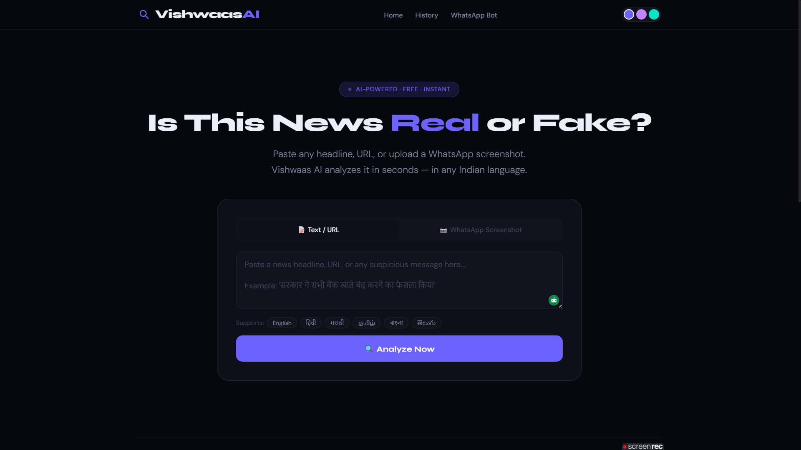
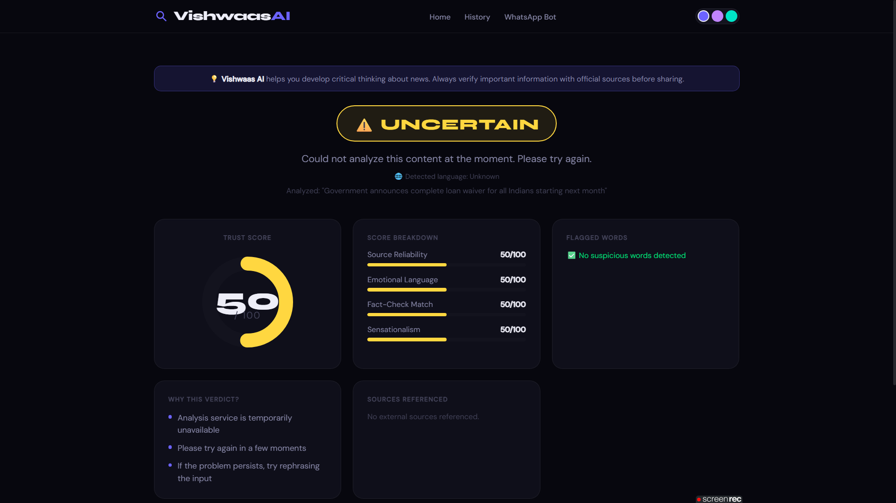
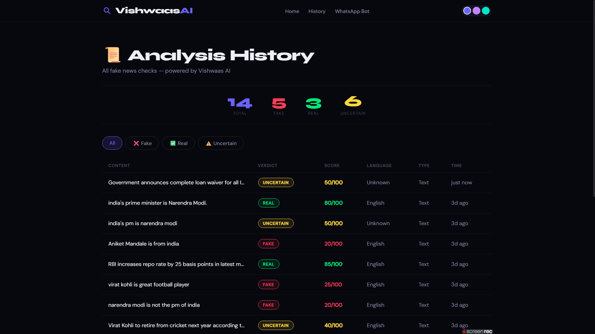

# Vishwaas AI — Fake News Detector for India

> **Team Vishwaas** | Aniket Mandale


---

## 🚀 Live Demo

**👉 [https://vishwaas-ai.vercel.app](https://vishwaas-ai.vercel.app)**

| Link | Description |
|---|---|
| [Frontend](https://vishwaas-ai.vercel.app) | Live web application |
| [Backend API](https://vishwaas-ai-api.onrender.com) | FastAPI REST API |
| [API Docs](https://vishwaas-ai-api.onrender.com/docs) | Interactive Swagger docs |

> **Note:** The live demo shows the full UI and all features.
> For complete AI analysis with decisive verdicts, clone and run locally —
> see the [How to Run Locally](#️-how-to-run-locally) section below.

---

## What is Vishwaas AI?

India is the world's largest consumer of misinformation. Every day, millions of fake news articles, fabricated headlines, and doctored screenshots are forwarded on WhatsApp in Hindi, Marathi, Tamil, Bengali, and other regional languages. Ordinary people have no fast, reliable way to verify what is real before sharing it further.

**Vishwaas AI** solves this. Any user can paste a suspicious headline, enter a news URL, or upload a WhatsApp screenshot and receive a detailed AI-powered credibility report in under 5 seconds — in any Indian language.

---

## 📸 Screenshots

### Landing Page


### Result Page


### History Page


---

## ✨ Features

| Feature | Description |
|---|---|
| 📝 Text Analysis | Paste any headline or URL for instant analysis |
| 📷 Image OCR | Upload WhatsApp screenshots — AI reads and analyzes them |
| 🌐 Indian Languages | Supports Hindi, Marathi, Tamil, Bengali, Telugu, English |
| 📊 Trust Score | Overall credibility score from 0 to 100 |
| 🔍 Score Breakdown | Source Reliability, Emotional Language, Fact-Check Match, Sensationalism |
| 🚨 Flagged Words | Specific suspicious words highlighted in red |
| 💡 AI Reasoning | 3-5 clear reasons explaining the verdict |
| 🔗 Sources Cited | Clickable real web sources used to reach the verdict |
| 📜 Private History | Each device has its own private analysis history |
| 🔥 Recently Debunked | Live feed of latest fake news caught |
| 🎨 3 Color Themes | Purple, Lilac, Teal — saved per user |
| 📱 PWA Ready | Installable on Android/iPhone like a native app |
| 💬 WhatsApp Bot | Coming Soon — forward messages directly to our bot |
| 📐 Fully Responsive | Mobile, Tablet, Desktop |

---

## 🛠️ Tech Stack

| Layer | Technology | Purpose |
|---|---|---|
| AI Engine | Google Gemini AI | Fake news analysis + Indian language support |
| Image OCR | Gemini Vision | WhatsApp screenshot reading |
| Backend | Python 3.14 + FastAPI | REST API server |
| Database | Supabase (PostgreSQL) | Store analysis history |
| Frontend | HTML5 + CSS3 + Vanilla JS | Web interface |
| Frontend Deploy | Vercel | Static hosting |
| Backend Deploy | Render | Python API hosting |
| PWA | manifest.json | Mobile installability |

---

## 📁 Project Structure

```
vishwaas-ai/
├── backend/
│   ├── main.py          # FastAPI server — all API endpoints
│   ├── analyzer.py      # AI analysis logic — Gemini prompt engineering
│   ├── database.py      # Supabase database operations
│   ├── requirements.txt # Python dependencies
│   └── .env             # API keys (never committed)
│
├── frontend/
│   ├── index.html       # Landing page
│   ├── result.html      # Analysis result page
│   ├── history.html     # Past checks history page
│   ├── 404.html         # Error page
│   ├── style.css        # All styles — 3 themes, responsive
│   ├── favicon.svg      # Browser tab icon
│   └── manifest.json    # PWA configuration
│
├── screenshots/         # Project screenshots
├── supabase_schema.sql  # Database schema
├── DEPLOY.md            # Deployment guide
└── README.md
```

---

## 🔌 API Endpoints

| Method | Endpoint | Description |
|---|---|---|
| GET | `/` | Health check |
| GET | `/health` | Server status |
| POST | `/analyze` | Analyze text or URL |
| POST | `/analyze-image` | Analyze WhatsApp screenshot |
| GET | `/recent` | Get recent checks for live feed |
| GET | `/history` | Get device-specific past checks |
| GET | `/stats` | Get FAKE/REAL/UNCERTAIN counts |

---

## ⚙️ How to Run Locally

### Prerequisites
- Python 3.11+
- Git

### 1. Clone the repository
```bash
git clone https://github.com/aniketmandale/vishwaas-ai.git
cd vishwaas-ai
```

### 2. Install dependencies
```bash
pip install -r backend/requirements.txt
```

### 3. Set up environment variables
Create `backend/.env` file:
```
GEMINI_API_KEY=your_gemini_key_here
SUPABASE_URL=your_supabase_url_here
SUPABASE_KEY=your_supabase_anon_key_here
```

### 4. Set up Supabase database
- Go to your Supabase project
- Open SQL Editor
- Run the contents of `supabase_schema.sql`

### 5. Start the backend
```bash
python -m uvicorn backend.main:app --reload --port 8000
```

### 6. Start the frontend
```bash
cd frontend
python -m http.server 3000
```

### 7. Open in browser
```
http://localhost:3000
```

---

## 🔄 How It Works

```
User Input (Text / URL / Image)
           ↓
FastAPI Backend (/analyze)
           ↓
Google Gemini AI
           ↓
Structured JSON Response
  ├── Overall Score (0-100)
  ├── Verdict (REAL / FAKE / UNCERTAIN)
  ├── 4 Sub-scores
  ├── Flagged Words
  ├── Reasons
  └── Clickable Sources
           ↓
Save to Supabase (device-specific)
           ↓
Display on Result Page
```

---

## 🗺️ Roadmap

- [ ] WhatsApp Bot via Meta Business API
- [ ] Browser extension for one-click fact checking
- [ ] Hindi/Regional language UI
- [ ] Community fact-checking and voting
- [ ] News source credibility database for India
- [ ] Mobile app (React Native)

---

## 👤 Author

| Name | Role |
|---|---|
| Aniket Mandale | Solo Developer — Full Stack + AI |

- 🔗 GitHub: [github.com/aniketmandale](https://github.com/aniketmandale)
- 💼 LinkedIn: [linkedin.com/in/aniket-mandale-2820111b8](https://linkedin.com/in/aniket-mandale-2820111b8)
- 📧 Email: aniketmandale999@gmail.com

---

## 📄 License

MIT License — free to use and modify.

---

> *Vishwaas (विश्वास) means "Trust" in Hindi — because every Indian deserves to trust the news they read.*
